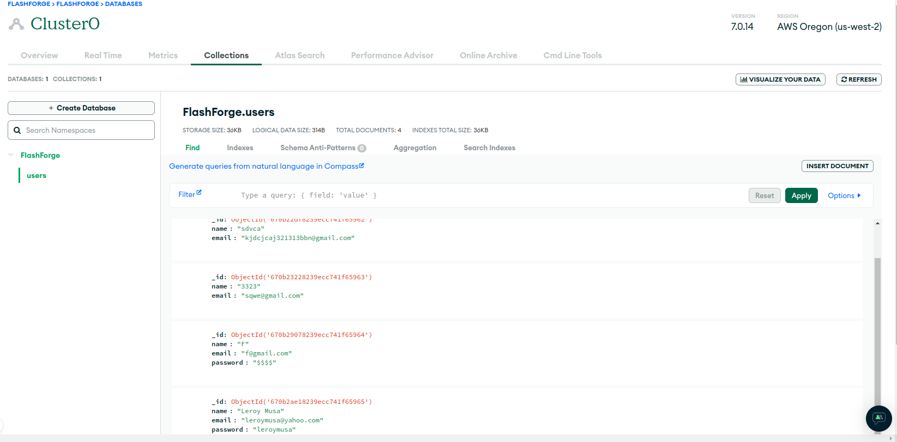
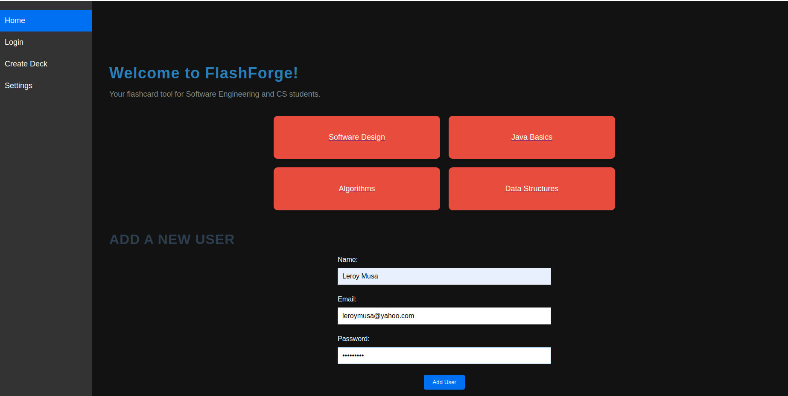
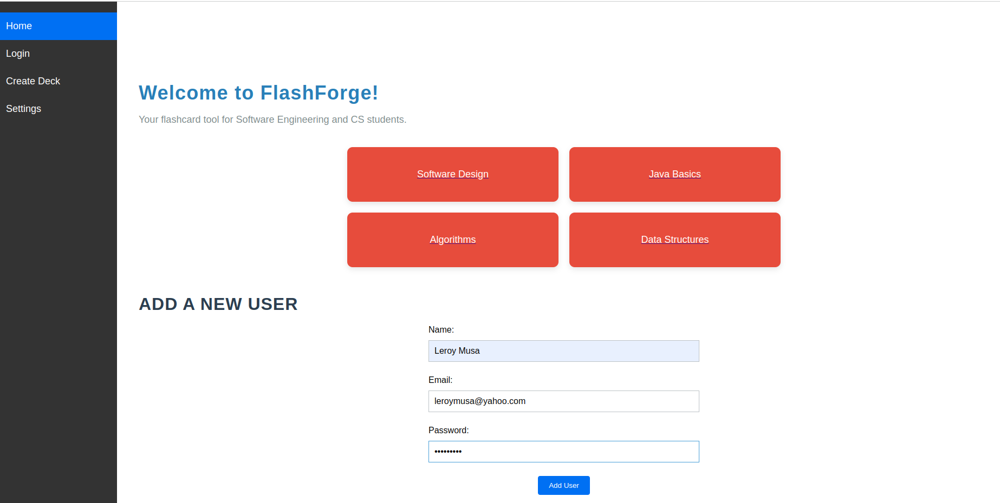
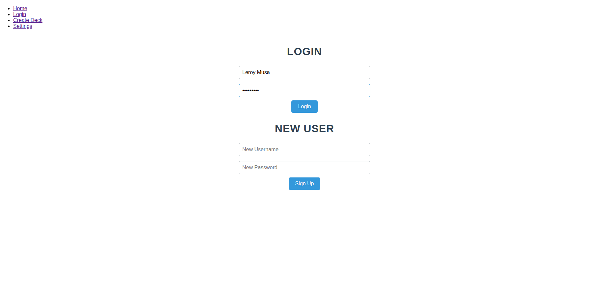

# Project Summary
**Summary:** FlashForge is an online flashcard website designed to help Computer Science and Software Engineering students study and prepare for exams. It is meant to serve as a study hub as it aims to provide users with an easy, organized, and interactive way to learn and engage with course material among each other using flashcards and other note forms. Users have the flexibility to choose from a library of pre-created flashcards or create personalized flashcards that cater to their specific course material and learning needs. By focusing on definitions, key concepts, and terminologies relevant to Computer Science and Software Engineering, FlashForge aims to be a go-to resource for academic review.

**Objective:** Build a flashcard study hub website specifically for Computer Science and Software Engineering students, where students can find and create their own flashcards based on Software Engineering/CS course material. The objective is to make learning more engaging, interactive, efficient, and collaborative in hopes of helping students grasp course content more strongly and achieve higher academic grades.

### **Key Personas:**
Kevin, a 20-year-old CS major, is struggling to study for an upcoming software design midterm. Kevin finds it challenging to remember key terms and definitions, especially when reviewing large amounts of information. He wants to find an easy-to-use study tool that will help him reinforce his knowledge and give him the ability to ask questions to his peers when needed. A solution specifically geared toward his needs that enables him to focus on the areas where he requires the most practice and gives him the ability to collaborate with other computer science students is what he needs.

Professor Donald, a 46 year old professor at York University is known for instructing EECS 3215, a generally hard course for students who are new to embedded systems. He cares for his students and wishes to give them a fun and memorable experience that they can reflect on to drive their interest in the field. The best way he's found to aid his students without giving away too much is to provide old midterms and slide notes, but a more personal method is something he's always pursued.

### **Key Scenario:** 
Kevin has a midterm next week and needs to review content for his software design class. Over the years collaboration and active recall of short-form notes has helped him retain and understand information best, this also reflected pointers he recieved from an academic advisor. Kevin really wants to succeed on this midterm as such an efficient study method which could possibly connect him with his peers is required.

Professor Donald is finding his students this semester to be very engaged in his course, he sees the drive in them and their desire to learn which motivates him to do his best as an instructor. Donald creates personalized notes for his class and while they could be posted to EClass, he wants future students with different instructors to have access to the same material. A site geared towards current and future students of EECS3215 would help fill his desire of pleasing his students and developing the future of embedded systems developers.

**Key Principle:** Efficient navigation as per user desire. The website should provide an experience catered to each user which prevents undesired topics from being seen. Each user should be presented a clean and non-bloated page with content they intend to see.

### User Interface & Setup
Figma Prototype: https://www.figma.com/proto/Uev8F3P6TTrRyGSRB8PI6K/Flashforge?node-id=603-83&t=mKJWK0iF44t3L99m-1

 

 

