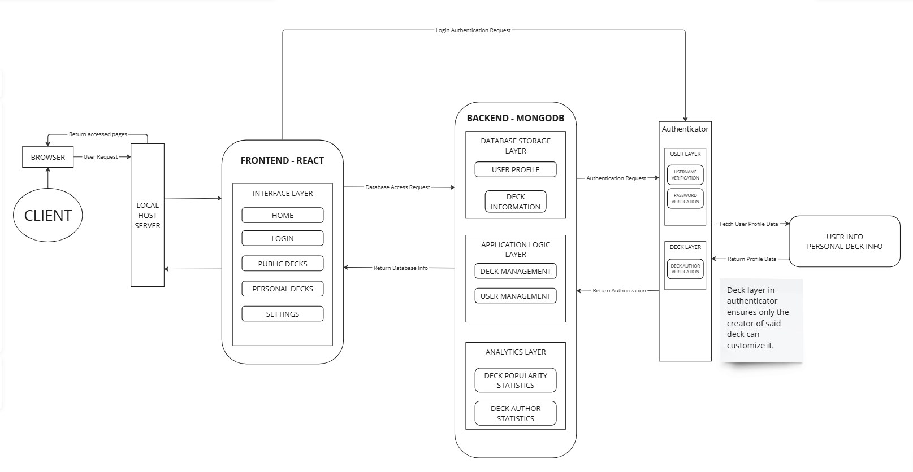

# System Design

**Project Name:** FlashForge

**Sprint:** 1

**Document Version:** 1.0.0

**Date:** 03/11/2024 [DD/MM/YYYY]

---

## Table of Contents

1. [Introduction](#1-introduction)
2. [High-Level System Architecture](#2-high-level-system-architecture)
3. [Class Design (CRC Cards)](#3-class-design-crc-cards)
4. [System Interaction with the Environment](#4-system-interaction-with-the-environment)
5. [Error and Exception Handling](#5-error-and-exception-handling)
6. [Appendix](#6-appendix)

---

### 1. Introduction

**FlashForge** is an online flashcard platform designed to help Computer Science and Software Engineering students study and prepare for exams. It serves as a study hub where users can engage with flashcards and other study tools tailored specifically to course content. Users can select from pre-created flashcards or create their own, focusing on definitions, key concepts, and terminologies to reinforce their learning. FlashForge aims to be a collaborative, engaging, and organized tool to improve academic performance.

---

### 2. High-Level System Architecture

**FlashForge**'s website architecture is divided into three main components: **Frontend (React.js/Next.js)**, **Backend (Node.js & Express)**, and **Database (MongoDB)**. Each component plays a vital role in managing user interactions, data storage, and overall system functionality.

#### Component Overview

- **Frontend (React.js/Next.js)**
  - **User Interface**: Provides an interactive and responsive UI with Light and Dark mode themes.
  - **Flashcard Deck Management**: Allows users to create, edit, view, and manage flashcards and decks.
  - **User Authentication**: Interface for user login, registration, and session management.
  - **API Requests**: Communicates with the backend to perform CRUD operations on flashcards, user data, and session management.
  - **Interactions**: Features like `FlipCard`, `NextCard`, and `ChooseDeck` enhance user engagement.

- **Backend (Node.js & Express)**
  - **API Endpoints**: Handles user requests through endpoints like `/login`, `/decks`, and `/user-profile`.
  - **Authentication Module**: Manages user authentication processes, including login, registration, and session validation.
  - **Flashcard Management Module**: Performs CRUD operations for flashcard decks, enabling users to create, retrieve, update, and delete flashcards.
  - **User Profile Management**: Stores and retrieves user preferences and session data.
  - **Collaboration Tools**: Supports peer-to-peer interaction features, such as sharing decks and commenting.

- **Database (MongoDB)**
  - **Users Collection**: Stores user profiles, including credentials (hashed passwords) and settings.
  - **Decks Collection**: Stores both pre-created and user-generated flashcard decks.
  - **Sessions Collection**: Manages session data for secure authentication.
  - **Collaboration Collection**: Tracks peer interactions, shared decks, and comments for collaborative features.

#### System Architecture Diagram

The following diagram provides an overview of the system's components and their interactions:

- **Frontend to Backend**: API requests handle user interactions, flashcard management, and authentication.
- **Backend to Database**: CRUD operations for storing user data, flashcard decks, and session data.
- **Styling**: Light and Dark mode styles apply to the frontend interface to enhance user experience.

#### System Decomposition

Each component in the architecture serves a distinct purpose within the higher-level structure:

- **User Interface (UI)**: Built with React.js/Next.js, it provides users with an engaging platform to navigate the website, access flashcards, and manage study settings.
- **Backend/API**: Manages data flow between the UI and the database, handling user requests, authentication, and business logic.
- **Database**: Stores persistent data such as user records, flashcard decks, and collaboration data, essential for a seamless user experience.

---

### 3. Class Design (CRC Cards)

Below is a high-level description of core classes/modules using **CRC Cards**. Each class outlines its primary responsibilities and interactions.

#### Class: `UserManager`

| **Class Name:** `UserManager` |
| --- |
| **Parent Class:** None |
| **Subclasses:** None |
| **Responsibilities:** |
| - Manage user data, including authentication and profile updates. |
| - Handle user sessions and security tokens. |
| - Validate user input during registration and login. |
| **Collaborators:** |
| - `mongodb.js` (for database interactions) |
| - `Authentication Module` (handles authentication logic) |
| - Frontend pages like `login.js` and `register.js` |

#### Class: `FlashcardManager`

| **Class Name:** `FlashcardManager` |
| --- |
| **Parent Class:** None |
| **Subclasses:** None |
| **Responsibilities:** |
| - Perform CRUD operations for flashcards and decks. |
| - Manage user interactions with flashcards (e.g., flipping cards, tracking progress). |
| - Interface with collaboration tools for sharing decks. |
| **Collaborators:** |
| - `mongodb.js` (for database interactions) |
| - Frontend pages like `create.js`, `decks.js`, `fullscreenDeck.js` |
| - `UserManager` (to associate decks with users) |

#### Class: `Navbar`

| **Class Name:** `Navbar` |
| --- |
| **Parent Class:** None |
| **Subclasses:** None |
| **Responsibilities:** |
| - Render the navigation bar with links to key pages. |
| - Update navigation options based on user authentication state. |
| - Provide access to theme toggling (Light/Dark mode). |
| **Collaborators:** |
| - Frontend pages in `/pages` directory |
| - `UserManager` (to determine authenticated state) |

#### Interaction Between Classes

- **`UserManager` and `FlashcardManager`**: Collaborate to associate flashcard decks with specific users and manage access permissions.
- **`Navbar` and `UserManager`**: `Navbar` queries `UserManager` to adjust navigation options based on whether a user is logged in.

---

### 4. System Interaction with the Environment

This section describes dependencies and environment assumptions for running the FlashForge website.

- **Operating System**: Cross-platform (Windows, macOS, Linux).
- **Programming Languages**: JavaScript (ES6+) for both frontend and backend.
- **Database**: MongoDB (version 4.4 or higher) for data storage.
- **Network Configuration**:
  - Requires internet access for API requests and database connections.
  - Backend server runs on standard HTTP/HTTPS ports.
- **Frameworks and Libraries**:
  - **Frontend**:
    - React.js (version 17 or higher)
    - Next.js (version 12 or higher)
    - Axios for API requests
  - **Backend**:
    - Node.js (version 14 or higher)
    - Express.js (version 4 or higher)
    - Mongoose for MongoDB interactions
  - **Styling**:
    - SCSS for styling components
    - CSS Modules for scoped styles

**Assumptions**:

- **Development Environment**:
  - Node.js and npm are installed on the development machine.
  - MongoDB instance is accessible, either locally or via a cloud service.
- **Production Environment**:
  - Deployed on a server with Node.js runtime.
  - Secure connections (HTTPS) are configured.
  - Environment variables are set for sensitive data (e.g., database URI, API keys).

---

### 5. Error and Exception Handling

This section outlines strategies for managing potential errors and exceptions.

#### Common Errors and Responses:

- **Invalid User Input**:
  - **Frontend**: Use form validation to prevent invalid data submission.
  - **Backend**: Validate data again before processing. Return informative error messages to the frontend.
- **Database Connection Errors**:
  - Implement retry logic with exponential backoff.
  - Log errors and alert administrators if the connection cannot be established after several attempts.
- **Authentication Failures**:
  - Provide clear feedback to users (e.g., "Incorrect email or password").
  - Limit login attempts to prevent brute-force attacks.
- **External API Failures**:
  - Gracefully handle failures by providing fallback options or informative messages.
  - Use circuit breaker patterns to prevent cascading failures.
- **Unhandled Exceptions**:
  - Use global error handlers in both frontend and backend to catch unexpected errors.
  - Log detailed error information for developers while showing user-friendly messages to users.

#### Exception Handling Strategy:

- **Logging**:
  - Utilize logging libraries like Winston or Morgan for backend logging.
  - Store logs in a centralized location for analysis.
- **User Feedback**:
  - Avoid technical jargon in error messages.
  - Provide actionable steps or contact information if the error persists.
- **Security Considerations**:
  - Do not expose stack traces or sensitive information in error messages.
  - Sanitize all inputs to prevent injection attacks.

---

### 6. Appendix

#### Glossary of Terms

- **CRUD**: Create, Read, Update, Delete - standard operations for data management.
- **API**: Application Programming Interface - allows different software applications to communicate.
- **Authentication Module**: Part of the system responsible for verifying user identities.
- **Session Management**: Handling user sessions to maintain stateful interactions.
- **Collaboration Tools**: Features that enable users to interact and share content.
- **Responsive UI**: User Interface that adapts to different screen sizes and devices.
- **Light/Dark Mode**: UI themes that adjust color schemes for user preference and accessibility.

#### References

- **Figma Prototype**: [FlashForge Figma Prototype](https://www.figma.com/proto/Uev8F3P6TTrRyGSRB8PI6K/Flashforge?node-id=603-83)
---